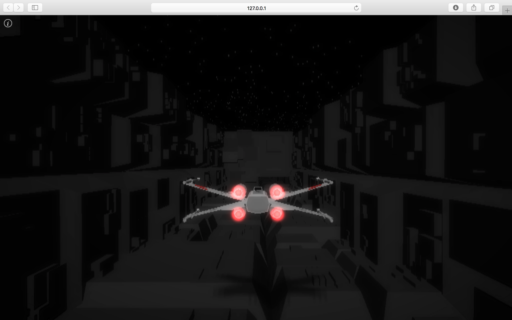

xwing
=====
[](https://travis-ci.com/amilajack/xwing)
[](https://greenkeeper.io/)

A WebGL game powered by three.js. The original code was from [moxiecode.com](http://oos.moxiecode.com/js_webgl/xwing/)

See the [live demo here](https://amilajack.github.io/xwing/)

<a href="https://amilajack.github.io/xwing/"></a>

## Setup
*Note: this project requires `yarn`. If you don't have it, run `npm i -g yarn`*
```bash
git clone https://github.com/amilajack/xwing
cd xwing
yarn
yarn start
```

## Todos
* Add webpack support
* Migrate to newer version of three.js
* Upgrade all code to ESNext
